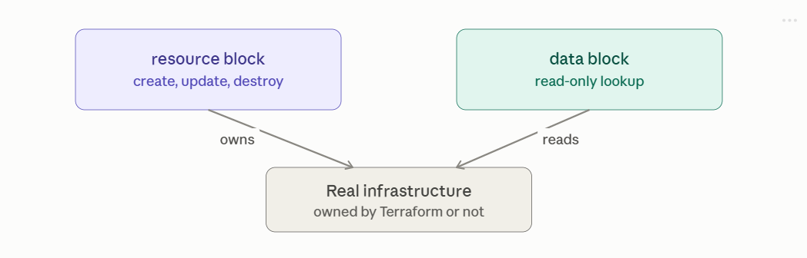

# Data Sources

Data sources let Terraform read information about infrastructure it doesn't manage — created by another team, another Terraform state, or just pre-existing in the platform — without taking ownership of it. Let's go through this properly.

## 1. What a data source is, in contrast to a resource

A resource block is Terraform saying "this should exist; I will create, update, and destroy it." A data block is Terraform saying "look this up and tell me its current attributes; I will never touch it." No create, no update, no destroy — purely read-only, and never appears as a create/destroy action in a plan.



2. Basic syntax

```
data "aws_ami" "ubuntu" {
  most_recent = true
  owners      = ["099720109477"]  # Canonical's AWS account

  filter {
    name   = "name"
    values = ["ubuntu/images/*22.04*"]
  }
  filter {
    name   = "virtualization-type"
    values = ["hvm"]
  }
}

resource "aws_instance" "web" {
  ami           = data.aws_ami.ubuntu.id
  instance_type = "t3.micro"
}
```

Reference syntax is data.<type>.<name>.<attribute> — the only structural difference from resource references is the data. prefix. Everything else (dependency graph inference, interpolation, use inside for_each) works exactly like resource references.

## 3. Common real-world data sources

```
# Current account/identity info
data "aws_caller_identity" "current" {}
# → data.aws_caller_identity.current.account_id

# Available AZs in the region
data "aws_availability_zones" "available" {
  state = "available"
}

# An existing VPC by tag, not by name you hardcode
data "aws_vpc" "main" {
  filter {
    name   = "tag:Name"
    values = ["prod-vpc"]
  }
}

# An existing Route53 zone
data "aws_route53_zone" "primary" {
  name = "example.com."
}

# Rendered policy document (very common pairing with IAM resources)
data "aws_iam_policy_document" "assume_role" {
  statement {
    actions = ["sts:AssumeRole"]
    principals {
      type        = "Service"
      identifiers = ["lambda.amazonaws.com"]
    }
  }
}
```

That last one is worth calling out: aws_iam_policy_document is technically a data source even though it doesn't read anything remote — it's just a convenient way to build a JSON policy string using HCL syntax instead of raw JSON.

## 4. Reading state from another Terraform configuration

This is the pattern for cross-team or cross-layer setups (e.g. a "networking" state managed by one team, consumed by an "app" team):

```
    data "terraform_remote_state" "networking" {
    backend = "s3"
    config = {
        bucket = "mycompany-terraform-state"
        key    = "prod/networking/terraform.tfstate"
        region = "us-east-1"
    }
    }

    resource "aws_instance" "app" {
    subnet_id = data.terraform_remote_state.networking.outputs.public_subnet_id
    }
```

This is exactly the mechanism that connects independently-managed state files: the networking team's output blocks become the app team's data.terraform_remote_state...outputs.* inputs — no shared code, no shared module, just reading a published interface.

## 5. When data sources get refreshed

Every terraform plan (unless run with -refresh=false) re-evaluates every data source by calling the provider — so a data source's value is essentially "live," not cached from a previous apply. This is a key difference from resources: a resource's known attributes come from its last recorded state (refreshed opportunistically), while a data source's attributes are recomputed from scratch on every single plan.

Practical effect: if the underlying AMI has a newer version published since your last apply, data.aws_ami.ubuntu.id can quietly change value between plans even though you changed nothing in your own config — worth being deliberate about (e.g. pinning most_recent = false with an explicit filter, if you want stability over "always latest").

## 6. Data sources depending on resources in the same config

Because data sources are evaluated as part of the same graph, you can chain a data source off a resource you just created:

```
    resource "aws_vpc" "main" {
    cidr_block = "10.0.0.0/16"
    }

    data "aws_subnets" "all_in_vpc" {
    filter {
        name   = "vpc-id"
        values = [aws_vpc.main.id]   # implicit dependency, same as resource-to-resource
    }
    }
```

This works via the same attribute-reference mechanism from your earlier dependency-graph question — Terraform sees aws_vpc.main.id used inside the data block and orders the VPC's creation before the data source's read.

The gotcha: if a data source's inputs depend on something whose value truly can't be known until apply time (a computed attribute), the entire read gets deferred to apply, and you lose plan-time visibility into what that data source will return — the plan just shows "(known after apply)" for anything downstream of it. This is one of the more common sources of confusing plans in larger configs, and occasionally needs an explicit depends_on on the data block if the relationship isn't expressed through a direct attribute reference.

## 7. for_each over a data source

Data sources that return a list/set can drive for_each on resources, letting you build resources for every item Terraform discovers rather than something you enumerate by hand:

```
    data "aws_subnets" "private" {
    filter {
        name   = "tag:Tier"
        values = ["private"]
    }
    }

    resource "aws_route_table_association" "private" {
    for_each       = toset(data.aws_subnets.private.ids)
    subnet_id      = each.value
    route_table_id = aws_route_table.private.id
    }
```

## 8. Beyond cloud infrastructure — utility data sources

A few data sources exist purely as helper utilities, not cloud lookups:

```
    data "http" "external_ip" {
    url = "https://ifconfig.me"
    }

    data "external" "custom_script" {
    program = ["python3", "${path.module}/scripts/lookup.py"]
    }

    data "local_file" "config" {
    filename = "${path.module}/config.json"
    }
```

external is the escape hatch when nothing in the provider ecosystem covers your lookup — it shells out to a script and expects a specific JSON contract on stdout/stdin.

## 9. Practical guidance

* Prefer data sources over hardcoding IDs (ami-0abc123) — a filtered lookup by tag/name adapts automatically across regions/accounts, a hardcoded ID silently breaks when it does.

* Don't use a data source to read something this same configuration also manages as a resource — reference the resource directly (aws_vpc.main.id), not data.aws_vpc.main.id; using a data source there creates an unnecessary extra read and a subtle race on first apply (the resource may not exist yet when the data source tries to read it).

* Be intentional about most_recent/"latest" style filters — they trade reproducibility for convenience, since a plan can differ between runs with zero config changes.

* For cross-team boundaries, terraform_remote_state is simple and effective, but consider that it exposes the entire outputs map of that state to the reader — some teams prefer a purpose-built data source (e.g., an SSM Parameter Store value, or a dedicated lookup table) as a narrower, more deliberate interface than "read everything the other team publishes."