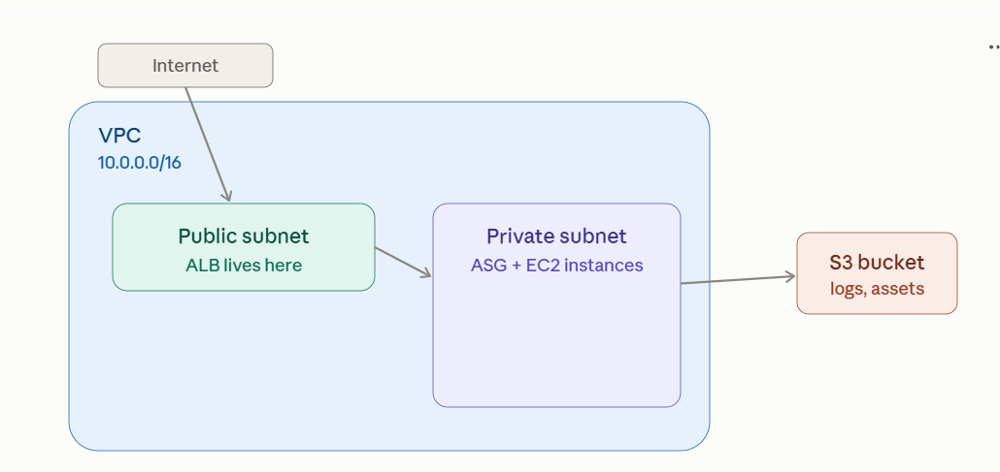

# Terraform with AWS services

Architected comprehensive AWS infrastructure blueprint integrating multiple services

This is where everything from the conversation comes together — resources, dependencies, security groups, modules-in-spirit — into one real, working AWS stack. 

Let's build it layer by layer: VPC → security groups → S3 → EC2/launch template → ASG → load balancer.

## The full picture first



That's the target: internet → ALB in a public subnet → EC2 instances (managed by an ASG) in a private subnet → an S3 bucket used by the app. Now let's build every layer.

## 1. VPC creation

```
resource "aws_vpc" "main" {
  cidr_block           = "10.0.0.0/16"
  enable_dns_support   = true
  enable_dns_hostnames = true
  tags = { Name = "main-vpc" }
}

resource "aws_internet_gateway" "main" {
  vpc_id = aws_vpc.main.id
  tags   = { Name = "main-igw" }
}

data "aws_availability_zones" "available" {
  state = "available"
}

resource "aws_subnet" "public" {
  count                   = 2
  vpc_id                  = aws_vpc.main.id
  cidr_block              = cidrsubnet(aws_vpc.main.cidr_block, 8, count.index)
  availability_zone       = data.aws_availability_zones.available.names[count.index]
  map_public_ip_on_launch = true
  tags = { Name = "public-${count.index}" }
}

resource "aws_subnet" "private" {
  count             = 2
  vpc_id            = aws_vpc.main.id
  cidr_block        = cidrsubnet(aws_vpc.main.cidr_block, 8, count.index + 10)
  availability_zone = data.aws_availability_zones.available.names[count.index]
  tags = { Name = "private-${count.index}" }
}

resource "aws_route_table" "public" {
  vpc_id = aws_vpc.main.id
  route {
    cidr_block = "0.0.0.0/0"
    gateway_id = aws_internet_gateway.main.id
  }
  tags = { Name = "public-rt" }
}

resource "aws_route_table_association" "public" {
  count          = length(aws_subnet.public)
  subnet_id      = aws_subnet.public[count.index].id
  route_table_id = aws_route_table.public.id
}
```

Two public subnets (for the load balancer) and two private subnets (for instances) across two AZs — spreading across AZs is what gives the ASG and ALB real fault tolerance. Notice data.aws_availability_zones (a data source from your earlier question) drives this instead of hardcoding AZ names.

## 2. Security groups

Two groups, deliberately layered — the ALB accepts public traffic; the instances only accept traffic from the ALB, never directly from the internet:

```
resource "aws_security_group" "alb" {
  name   = "alb-sg"
  vpc_id = aws_vpc.main.id

  ingress {
    from_port   = 443
    to_port     = 443
    protocol    = "tcp"
    cidr_blocks = ["0.0.0.0/0"]
  }
  egress {
    from_port   = 0
    to_port     = 0
    protocol    = "-1"
    cidr_blocks = ["0.0.0.0/0"]
  }
  tags = { Name = "alb-sg" }
}

resource "aws_security_group" "app" {
  name   = "app-sg"
  vpc_id = aws_vpc.main.id

  ingress {
    from_port       = 8080
    to_port         = 8080
    protocol        = "tcp"
    security_groups = [aws_security_group.alb.id]   # only the ALB, not 0.0.0.0/0
  }
  egress {
    from_port   = 0
    to_port     = 0
    protocol    = "-1"
    cidr_blocks = ["0.0.0.0/0"]
  }
  tags = { Name = "app-sg" }
}
```

That security_groups = [aws_security_group.alb.id] line is exactly the implicit-dependency pattern from earlier — it creates a graph edge and enforces "only traffic originating from the ALB's security group is allowed in," which is the standard defense-in-depth pattern for this architecture.

## 3. S3

```
resource "aws_s3_bucket" "app_assets" {
  bucket = "myapp-assets-${terraform.workspace}"
}

resource "aws_s3_bucket_versioning" "app_assets" {
  bucket = aws_s3_bucket.app_assets.id
  versioning_configuration { status = "Enabled" }
}

resource "aws_s3_bucket_public_access_block" "app_assets" {
  bucket                  = aws_s3_bucket.app_assets.id
  block_public_acls       = true
  block_public_policy     = true
  ignore_public_acls      = true
  restrict_public_buckets = true
}

resource "aws_iam_role" "ec2_role" {
  name = "app-ec2-role"
  assume_role_policy = jsonencode({
    Version = "2012-10-17"
    Statement = [{
      Action    = "sts:AssumeRole"
      Effect    = "Allow"
      Principal = { Service = "ec2.amazonaws.com" }
    }]
  })
}

resource "aws_iam_role_policy" "s3_access" {
  name = "s3-access"
  role = aws_iam_role.ec2_role.id
  policy = jsonencode({
    Version = "2012-10-17"
    Statement = [{
      Effect   = "Allow"
      Action   = ["s3:GetObject", "s3:PutObject"]
      Resource = "${aws_s3_bucket.app_assets.arn}/*"
    }]
  })
}

resource "aws_iam_instance_profile" "ec2_profile" {
  name = "app-ec2-profile"
  role = aws_iam_role.ec2_role.name
}
```

Instances get S3 access through an instance profile / IAM role, not access keys baked into config — this is the standard secure pattern, and note the ${terraform.workspace} interpolation from your workspaces question giving the bucket a unique name per environment.

## 4. EC2 deployment (via launch template, not a bare instance)

For a real deployment you don't create aws_instance directly when there's an ASG — you define a launch template that the ASG uses to stamp out instances:

```
data "aws_ami" "app" {
  most_recent = true
  owners      = ["099720109477"]
  filter {
    name   = "name"
    values = ["ubuntu/images/*22.04*"]
  }
}

resource "aws_launch_template" "app" {
  name_prefix   = "app-"
  image_id      = data.aws_ami.app.id
  instance_type = "t3.micro"

  iam_instance_profile {
    name = aws_iam_instance_profile.ec2_profile.name
  }

  vpc_security_group_ids = [aws_security_group.app.id]

  user_data = base64encode(<<-EOF
    #!/bin/bash
    echo "Hello from $(hostname)" > /var/www/html/index.html
  EOF
  )

  tag_specifications {
    resource_type = "instance"
    tags = { Name = "app-instance" }
  }
}
```

user_data here is the cloud-init pattern from your provisioners question — configuring the instance at boot without any SSH/remote-exec needed.

## 5. Auto Scaling Group

```
resource "aws_autoscaling_group" "app" {
  name                = "app-asg"
  vpc_zone_identifier = aws_subnet.private[*].id
  min_size            = 2
  max_size            = 6
  desired_capacity    = 2
  target_group_arns   = [aws_lb_target_group.app.arn]
  health_check_type   = "ELB"

  launch_template {
    id      = aws_launch_template.app.id
    version = "$Latest"
  }

  tag {
    key                 = "Name"
    value               = "app-asg-instance"
    propagate_at_launch = true
  }
}

resource "aws_autoscaling_policy" "scale_up" {
  name                   = "scale-up"
  autoscaling_group_name = aws_autoscaling_group.app.name
  adjustment_type        = "ChangeInCapacity"
  scaling_adjustment      = 1
  cooldown                = 300
}

resource "aws_cloudwatch_metric_alarm" "high_cpu" {
  alarm_name          = "app-high-cpu"
  comparison_operator = "GreaterThanThreshold"
  evaluation_periods  = 2
  metric_name         = "CPUUtilization"
  namespace           = "AWS/EC2"
  period              = 120
  statistic           = "Average"
  threshold           = 70
  alarm_actions       = [aws_autoscaling_policy.scale_up.arn]
  dimensions = {
    AutoScalingGroupName = aws_autoscaling_group.app.name
  }
}
```

vpc_zone_identifier = aws_subnet.private[*].id (splat expression, from your dependency-management question) spreads instances across both private subnets/AZs automatically. target_group_arns is what wires the ASG to the load balancer below — new instances register themselves with the target group as they launch.

## 6. Load balancer

```
resource "aws_lb" "app" {
  name               = "app-alb"
  internal           = false
  load_balancer_type = "application"
  security_groups    = [aws_security_group.alb.id]
  subnets            = aws_subnet.public[*].id
}

resource "aws_lb_target_group" "app" {
  name     = "app-tg"
  port     = 8080
  protocol = "HTTP"
  vpc_id   = aws_vpc.main.id

  health_check {
    path                = "/"
    healthy_threshold   = 2
    unhealthy_threshold = 3
    interval            = 30
  }
}

resource "aws_lb_listener" "http" {
  load_balancer_arn = aws_lb.app.arn
  port              = 80
  protocol          = "HTTP"

  default_action {
    type             = "forward"
    target_group_arn = aws_lb_target_group.app.arn
  }
}
```

## 7. Tracing the dependency chain end to end

Every arrow here is an implicit dependency from an attribute reference — nothing needed depends_on in this whole stack:

    aws_vpc.main
    ├─ aws_internet_gateway.main
    ├─ aws_subnet.public/private
    ├─ aws_security_group.alb / app
    └─ ...
        aws_launch_template.app  ─┐
        aws_lb_target_group.app  ─┼─> aws_autoscaling_group.app
        aws_subnet.private[*]    ─┘
        aws_lb.app  ─> aws_lb_listener.http ─> forwards to target group

Terraform figures out that the VPC and subnets must exist before the security groups, the security groups before the launch template, and both the launch template and target group before the ASG — all from the reference graph covered in your dependency-management question, run with the parallelism that graph enables.

## 8. Where this connects to everything else you've learned

* This whole thing is a natural candidate to become a reusable module (modules/web-app/) parameterized by instance_type, min_size, max_size — exactly the pattern from your modules question.

* State for this stack should live in the S3 backend with native locking from your remote-state question.

* Multiple environments (dev/staging/prod) of this exact stack are better served by directory-per-environment, not CLI workspaces, per the tradeoffs discussed there — though terraform.workspace interpolation is used above for the S3 bucket name as a quick illustration.

* The data.aws_ami lookup and data.aws_availability_zones are both data sources reading live AWS state rather than hardcoded values.

