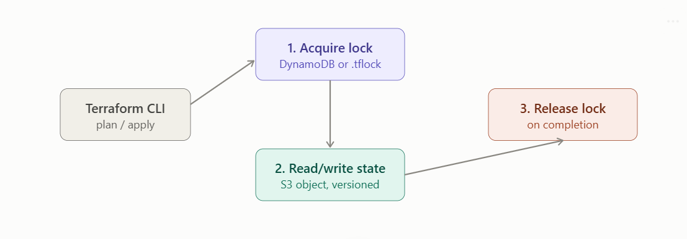

# Remote state - S3 backend - state locking(dynamodb)

Since Terraform 1.11 (GA; introduced experimentally in 1.10), the S3 backend can lock state natively without DynamoDB at all. I'll teach both, since a lot of existing infrastructure still uses DynamoDB, but point you at the current recommended path.

## 1. Why remote state exists

By default, Terraform writes terraform.tfstate to your local disk. That's fine solo, but breaks down immediately for teams:

* **No sharing** — a second person's plan has no idea what the first person already created.

* **No locking** — two people running apply simultaneously can corrupt the state file or race against the same real infrastructure.

* **No durability** — a laptop dying or a .tfstate accidentally committed with secrets in it is a disaster.

A backend tells Terraform where to store state instead of locally, and (for backends that support it) how to lock it during operations.



## 2. What's actually inside terraform.tfstate

Before configuring backends, it helps to know what you're storing: 

* a JSON document mapping every resource address to its full attribute set as last known, plus metadata (Terraform version, serial number for optimistic concurrency, and a lineage UUID identifying this state file's history). 

* It also stores outputs, and — critically — often contains sensitive values in plaintext (DB passwords, private keys) unless marked sensitive and the backend encrypts at rest. 

* This is exactly why "just commit tfstate to git" is a bad idea, and why S3 + encryption + access control is the standard pattern.

## 3. The S3 backend — full example

```
terraform {
  backend "s3" {
    bucket       = "mycompany-terraform-state"
    key          = "prod/networking/terraform.tfstate"
    region       = "us-east-1"
    encrypt      = true
    use_lockfile = true   # native S3 locking (Terraform 1.11+)
  }
}
```

* **bucket** — the S3 bucket holding all your state objects (usually one bucket per org/account, shared across projects, differentiated by key).

* **key** — the object path within the bucket. Convention: <env>/<component>/terraform.tfstate so multiple projects/environments share one bucket without colliding.

* **region** — the bucket's AWS region.

* **encrypt** — enables SSE (server-side encryption) on the state object. Always set this to true.

* **use_lockfile** — the modern locking flag, covered below.

**Important:** backend blocks cannot use variables or locals — they're evaluated before the rest of your config, so everything must be a literal, or passed in via -backend-config files/flags (useful for reusing the same .tf across environments):

    terraform init -backend-config="key=staging/networking/terraform.tfstate"

**Bootstrapping the bucket itself**

You can't terraform apply the very bucket that will hold your state (chicken-and-egg), so this is typically created once, either by hand or via a separate bootstrap Terraform run using local state:

```
resource "aws_s3_bucket" "tfstate" {
  bucket = "mycompany-terraform-state"

  lifecycle {
    prevent_destroy = true
  }
}

resource "aws_s3_bucket_versioning" "tfstate" {
  bucket = aws_s3_bucket.tfstate.id
  versioning_configuration {
    status = "Enabled"
  }
}

resource "aws_s3_bucket_server_side_encryption_configuration" "tfstate" {
  bucket = aws_s3_bucket.tfstate.id
  rule {
    apply_server_side_encryption_by_default {
      sse_algorithm = "aws:kms"
    }
  }
}

resource "aws_s3_bucket_public_access_block" "tfstate" {
  bucket                  = aws_s3_bucket.tfstate.id
  block_public_acls       = true
  block_public_policy     = true
  ignore_public_acls      = true
  restrict_public_buckets = true
}
```

**Versioning is non-negotiable**. It's your rollback mechanism if state gets corrupted or a bad apply overwrites good state — you can pull a previous object version straight from S3.

## 4. State locking — the concept

Every plan or apply needs to prevent a second concurrent run from touching the same state at the same time; without it, two runs could both read state version N, both compute independent diffs, and both write back — the second write silently clobbers the first, and worse, could apply against real infrastructure that's already changed underneath it. Locking makes this atomic: whoever acquires the lock first proceeds, everyone else's plan/apply blocks (or fails) until it's released.

## 5. Locking — the two ways, and which to use

**A) Classic: DynamoDB locking (still widely deployed, now deprecated)**

For years, this was the only way to lock an S3 backend. 

The mechanism: Terraform writes a record to a DynamoDB table using a conditional write keyed on LockID — DynamoDB guarantees only one writer can create that record, which is what makes the lock atomic.

```
resource "aws_dynamodb_table" "tf_locks" {
  name         = "terraform-locks"
  billing_mode = "PAY_PER_REQUEST"
  hash_key     = "LockID"

  attribute {
    name = "LockID"
    type = "S"
  }
}
```
```
terraform {
  backend "s3" {
    bucket         = "mycompany-terraform-state"
    key            = "prod/networking/terraform.tfstate"
    region         = "us-east-1"
    encrypt        = true
    dynamodb_table = "terraform-locks"
  }
}
```

When a lock is held, a second run trying to apply gets:

    Error: Error acquiring the state lock

    Lock Info:
    ID:        a1b2c3d4-e5f6-7890-abcd-ef1234567890
    Path:      mycompany-terraform-state/prod/networking/terraform.tfstate
    Operation: OperationTypeApply
    Who:       ci-runner@build-42
    Created:   2026-08-11 10:14:02 UTC

If a run crashes without releasing the lock (killed CI job, laptop dying mid-apply), you clear it manually with the lock ID:

```
terraform force-unlock a1b2c3d4-e5f6-7890-abcd-ef1234567890
```

**B) Current: native S3 locking with use_lockfile (recommended since Terraform 1.11)**

Terraform's S3 backend can lock state on its own through the use_lockfile argument, with no DynamoDB table required, using S3 conditional writes to write a lock object next to the state file. 

This became generally available with Terraform 1.10/1.11, using S3 Object Lock instead of a DynamoDB conditional-write record. 

```
terraform {
  backend "s3" {
    bucket       = "mycompany-terraform-state"
    key          = "prod/networking/terraform.tfstate"
    region       = "us-east-1"
    encrypt      = true
    use_lockfile = true
  }
}
```

That's the entire configuration — no separate table, no extra IAM policy for DynamoDB actions. It works via a conditional write that creates a .tflock object next to your state file; conflicts surface as a 412 PreconditionFailed error. A concurrent run gets essentially the same "lock held by X" error as the DynamoDB path, and terraform force-unlock still works — it just removes the .tflock object instead of a DynamoDB item. 

**Why this is now preferred:** it removes the always-on DynamoDB cost, one fewer resource to create and manage, no lock-table drift where the table gets deleted but stale references remain, and simpler IAM since you only need S3 permissions. 

**Migrating an existing DynamoDB-locked project:** upgrade to Terraform 1.11+, then simply add use_lockfile = true to the backend block. For transition safety you can keep both dynamodb_table and use_lockfile = true set simultaneously while you validate, then drop the DynamoDB argument once your team has run a few successful cycles. 

## 6. Recommended IAM policy for the backend

Minimal permissions needed by whoever/whatever runs Terraform (CI role, engineer's IAM user):

```
    {
    "Version": "2012-10-17",
    "Statement": [
        {
        "Effect": "Allow",
        "Action": ["s3:GetObject", "s3:PutObject", "s3:DeleteObject"],
        "Resource": "arn:aws:s3:::mycompany-terraform-state/*"
        },
        {
        "Effect": "Allow",
        "Action": ["s3:ListBucket"],
        "Resource": "arn:aws:s3:::mycompany-terraform-state"
        }
    ]
    }
```

(s3:DeleteObject is needed because the .tflock file is deleted on lock release. If you're on DynamoDB locking instead, swap that block for dynamodb:GetItem, PutItem, DeleteItem on the lock table's ARN.)

## 7. Day-to-day workflow with this backend

    terraform init                 # connects to S3 backend, downloads existing state
    terraform plan                 # acquires lock → reads state → computes diff → releases lock
    terraform apply                # acquires lock → applies → writes new state → releases lock
    terraform state list           # reads current state to list tracked resources

If two teammates run apply at nearly the same moment, the second one blocks on lock acquisition until the first finishes — exactly the failure mode remote state + locking exists to prevent.

## 8. Practical recommendations
* New projects on Terraform ≥1.11: use use_lockfile = true, skip DynamoDB entirely.

* Existing DynamoDB setups: not urgent to migrate, but the S3 backend documentation now deprecates the dynamodb_table option, so plan a migration rather than building new projects on it. 

* Always enable bucket versioning + encryption regardless of which locking method you use — that's your safety net independent of locking.

* One state file per logical unit of infrastructure (e.g., per environment × component) rather than one giant state — smaller blast radius, faster plan, less lock contention across teams.