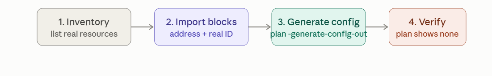

# 4. Import Existing Infrastructure

This is the bridge between infrastructure that already exists (created by hand, by another tool, or before your team adopted Terraform) and bringing it under Terraform's management — without destroying and recreating it.

The classic terraform import command

```
terraform import aws_instance.web i-0abc123def456789
```

The syntax is terraform import <resource_address> <provider_specific_id>. Each resource type defines its own import ID format — an EC2 instance uses its instance ID, an S3 bucket uses its bucket name, some resources need compound IDs (vpc-id/subnet-id) — always check that specific resource's documentation for the expected format.

Critical limitation: classic import only populates state — it does not generate configuration. You must already have a matching (even if empty) resource block in your .tf files before running import:

```
resource "aws_instance" "web" {
  # intentionally empty for now — import will populate state,
  # but you still have to hand-write matching arguments here
}
```

```
terraform import aws_instance.web i-0abc123def456789
terraform plan   # will show a large diff: every real attribute vs your empty config
```

That plan diff after import is actually useful — it's effectively listing every attribute the resource has, in reverse, which you then transcribe into your resource block until plan shows zero changes. This is tedious for complex resources, which is exactly what the modern approach below fixes.

**The modern approach:** import blocks + config generation (Terraform ≥1.5)

```
import {
  to = aws_instance.web
  id = "i-0abc123def456789"
}
```
```bash
terraform plan -generate-config-out=generated.tf
```

This does what classic import couldn't: it writes an actual resource block for you, with real attribute values populated, into generated.tf. You then review/clean up that generated file (rename it, fold it into your normal file structure, remove any redundant defaults) and run terraform apply to formally bring it into state.

```
# generated.tf (auto-produced, example)
resource "aws_instance" "web" {
  ami                    = "ami-0abcdef1234567890"
  instance_type          = "t3.micro"
  subnet_id              = "subnet-0a1b2c3d"
  vpc_security_group_ids = ["sg-0e1f2a3b"]
  # ... every real attribute, pre-filled
}
```

This is a genuinely large quality-of-life improvement over hand-transcribing a plan diff, and is the recommended approach for anything beyond a single trivial resource. import blocks can also be batched — many import blocks in one file, each targeting a different resource, all resolved in a single plan -generate-config-out run.

**Migrating manual infrastructure to IaC,**

Walking through each step in detail:



**1. Inventory what actually exists.** Before writing any Terraform, get a complete list of the real resources you need to bring in — for AWS, this often means going account-by-account, service-by-service in the console, or using AWS Config/Resource Explorer to enumerate everything. Tools like terraformer (community-maintained, generates both import statements and starter config by scanning a live account) can accelerate this for large environments, though its output usually still needs cleanup — treat it as a first draft, not final config.

**2. Write import blocks for each resource, addressed to where you want it in your module structure.**

```hcl
import {
  to = aws_vpc.main
  id = "vpc-0a1b2c3d4e5f"
}
import {
  to = aws_subnet.public[0]
  id = "subnet-0f1e2d3c4b5a"
}
```

**3. Generate config, then review it critically — don't blindly accept it.** -generate-config-out produces a technically-correct block, but often with every attribute explicitly pinned (including defaults that don't need to be set), no use of variables, no for_each/count, and no connection to your existing module structure. 

Clean this up: replace hardcoded values with var.* references where it should be parameterized, fold repeated patterns into for_each, and move things into whatever module they logically belong in.

**4. Verify with a clean plan **— this is the step that actually confirms success. After import + config cleanup:

```bash
terraform plan
# should show: No changes. Your infrastructure matches the configuration.
```

If it doesn't, your config doesn't yet match reality exactly — iterate until it does, before running apply. Applying prematurely against not-quite-matching config risks unintentionally modifying real infrastructure the first time Terraform touches it.

## Practical gotchas worth knowing

* Sensitive attributes usually aren't populated by import. Passwords, secrets, and similar fields typically can't be read back from the provider API (write-only), so generated config will have them blank — you fill those in manually, ideally via the secrets-management pattern from earlier, not hardcoded.

* Import doesn't handle relationships/dependencies for you. If you're importing a VPC and its subnets, you still need to decide the reference structure yourself (should the subnet's vpc_id be a hardcoded string, or aws_vpc.main.id?) — generated config often defaults to hardcoded IDs, which you should replace with proper references to preserve the implicit-dependency graph from your earlier question.

* Do this incrementally, not as one giant migration. Import and verify a handful of related resources at a time (one VPC and its direct children, say), confirming clean plans as you go, rather than attempting to import an entire account in one pass — a mistake compounds much less painfully in a small batch.

* terraform state list after each batch is a good sanity check that everything you intended to import actually landed correctly, with the addresses you expected.

**Where this connects back**

This whole workflow is exactly why state recovery (Topic 1) and import share a mechanism — state rm + import is literally how you fix a single corrupted or lost resource's tracking. And once resources are imported, everything else from this conversation applies normally: they're subject to the same drift detection, the same dependency graph, and are natural candidates to get refactored into the modules pattern from earlier once the initial import is stable.