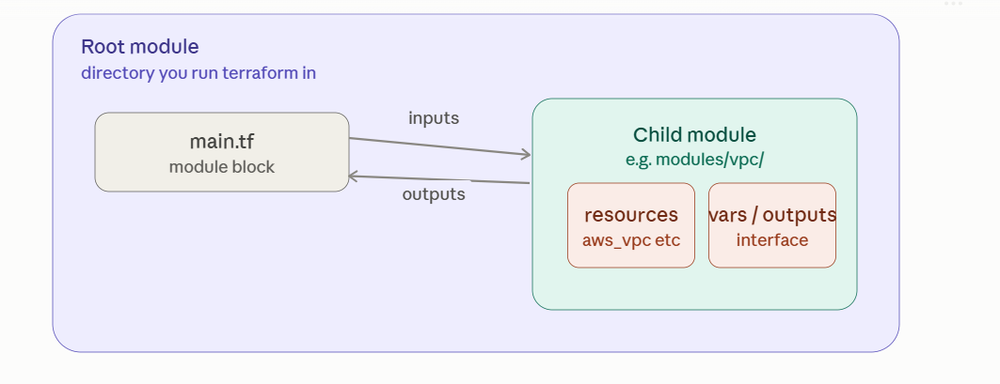

# Module

Modules are how Terraform scales beyond a single flat file of resources into something reusable, composable, and shareable across teams.

## 1. What is a module?

A module is just a directory containing .tf files. That's the whole definition — there's no special manifest or module.json. 

Any folder Terraform can init against is a module. This means every Terraform configuration you've written so far has technically already been a module.

    networking/
    ├── main.tf
    ├── variables.tf
    └── outputs.tf

That's a complete, valid module.

What makes modules powerful is that a module can be called by another module, passing in inputs and receiving outputs — like a function call, but for infrastructure.

## 2. Root module vs. child module



* **Root module** — the directory where you actually run terraform init/plan/apply. Every Terraform run has exactly one root module. It's the entry point of the whole graph.

* **Child module** — any module that gets called from another module (root or another child) via a module block. Child modules don't get run directly; they're invoked.

A child module is completely ordinary Terraform — the only thing that makes it a "child" is that something else is calling it. The same directory could be run directly as a root module too.

## 3. Anatomy of a reusable module

A well-designed child module looks like a small self-contained package with a clear interface:

    modules/vpc/
    ├── main.tf        # resources
    ├── variables.tf   # its inputs (the "parameters")
    ├── outputs.tf      # its outputs (the "return values")
    └── versions.tf     # required_providers / required_version

```
# modules/vpc/variables.tf
variable "cidr_block" {
  type        = string
  description = "CIDR range for the VPC"
}

variable "name" {
  type = string
}

# modules/vpc/main.tf
resource "aws_vpc" "this" {
  cidr_block = var.cidr_block
  tags = { Name = var.name }
}

resource "aws_subnet" "public" {
  vpc_id     = aws_vpc.this.id
  cidr_block = cidrsubnet(var.cidr_block, 4, 0)
}

# modules/vpc/outputs.tf
output "vpc_id" {
  value = aws_vpc.this.id
}

output "public_subnet_id" {
  value = aws_subnet.public.id
}
```

**variables.tf** and **outputs.tf** together are the module's public interface — everything else inside is an implementation detail the caller doesn't need to know about.

## 4. Calling a module from the root

```
module "app_network" {
  source     = "./modules/vpc"
  cidr_block = "10.0.0.0/16"
  name       = "app-vpc"
}

resource "aws_instance" "web" {
  subnet_id = module.app_network.public_subnet_id   # reading the module's output
  ami       = "ami-0abcdef1234567890"
  instance_type = "t3.micro"
}
```

**source** tells Terraform where to find the module. This accepts several formats:

* **Local path** — ./modules/vpc (must start with ./ or ../)

* **Terraform Registry** — "terraform-aws-modules/vpc/aws" with a separate version argument

* **Git** — "git::https://github.com/org/repo.git//path?ref=v1.2.0"

* **S3/GCS bucket** — "s3::https://s3.amazonaws.com/bucket/module.zip"

* **Generic HTTP** — pointing at a zip archive

Registry modules also take version constraints, just like providers:

```
module "vpc" {
  source  = "terraform-aws-modules/vpc/aws"
  version = "~> 5.8"
  cidr    = "10.0.0.0/16"
}
```

## 5. The reusability concept in depth

This is the core value proposition of modules: write the pattern once, parameterize the differences, instantiate it many times.

Without modules, three environments duplicate the whole VPC/subnet/routing block three times, and any bugfix has to be copy-pasted into all three. With a module, the pattern lives once, and each environment becomes a short, declarative call:

```
module "vpc_dev" {
  source     = "./modules/vpc"
  cidr_block = "10.0.0.0/16"
  name       = "dev"
}

module "vpc_staging" {
  source     = "./modules/vpc"
  cidr_block = "10.1.0.0/16"
  name       = "staging"
}

module "vpc_prod" {
  source     = "./modules/vpc"
  cidr_block = "10.2.0.0/16"
  name       = "prod"
}
```

This is Terraform's version of DRY (don't repeat yourself). A few things make reusability actually work well in practice:

* **Sensible defaults** — give non-critical variables a default so callers only need to specify what actually varies for them.

* **Validation blocks** — catch misconfiguration early:
```
  variable "cidr_block" {
    type = string
    validation {
      condition     = can(cidrhost(var.cidr_block, 0))
      error_message = "Must be a valid CIDR block."
    }
  }
```

* **Semantic versioning on the module itself** — once a module is used by multiple teams/repos, tag releases (v1.0.0, v1.1.0) so consumers can pin a version and upgrade deliberately rather than getting surprise changes.

* **A stable interface** — treat variables.tf/outputs.tf like a public API; breaking changes there break every caller, so add new optional variables rather than renaming existing required ones where possible.

## 6. Multiple instances with count / for_each on a module block

Just like resources, a module block itself can be repeated:

```
module "vpc" {
  for_each   = { dev = "10.0.0.0/16", staging = "10.1.0.0/16", prod = "10.2.0.0/16" }
  source     = "./modules/vpc"
  cidr_block = each.value
  name       = each.key
}
```
Then reference specific instances as module.vpc["dev"].vpc_id, etc. — collapses the earlier three-block example into one, iterated.

## 7. Nested modules (module composition)

Modules can call other modules — there's no restriction on depth (though 2–3 levels is a practical sanity limit). This lets you build higher-level abstractions out of smaller building blocks:

    modules/
    ├── vpc/            # low-level: VPC, subnets, routing
    ├── ecs-cluster/     # mid-level: calls vpc module + creates ECS cluster
    └── webapp/          # high-level: calls ecs-cluster module + creates a service

```
# modules/webapp/main.tf
module "cluster" {
  source     = "../ecs-cluster"
  cidr_block = var.cidr_block
}

resource "aws_ecs_service" "app" {
  cluster = module.cluster.cluster_id
  # ...
}
```

From the root module's perspective, calling module "webapp" transparently pulls in everything underneath — the root doesn't need to know ecs-cluster or vpc exist at all. This is where the real leverage of modules shows up: teams publish a small number of high-level, opinionated modules ("give me a standard web app"), and consumers stop thinking about individual cloud resources entirely.

## 8. Provider handling inside modules

By default, a child module inherits the default (unaliased) provider configuration from its caller automatically — you don't need to pass it explicitly. But if a module needs a specific aliased provider (e.g. multi-region), you pass it explicitly via the providers argument:

```
module "vpc_west" {
  source = "./modules/vpc"
  providers = {
    aws = aws.west
  }
  cidr_block = "10.3.0.0/16"
  name       = "west"
}
```

As of modern Terraform, a module that needs multiple/aliased providers must declare which provider "slots" it expects in its own required_providers (using configuration_aliases), making the requirement explicit rather than implicit.

## 9. State and addressing for module resources

Resources inside a module still get tracked in the same state file as everything else (unless that module has its own separate backend, which is unusual) — just prefixed with the module path:

```
    module.app_network.aws_vpc.this
    module.vpc["prod"].aws_subnet.public
```

terraform state list, state mv, state rm, and -target all work with these fully-qualified module addresses.

## 10. Publishing and discovering modules

The public Terraform Registry hosts community and HashiCorp-verified modules for common patterns (VPCs, EKS clusters, RDS, IAM roles) — often better to reuse a well-maintained public module than write your own from scratch for common infrastructure. Organizations also run private module registries (built into Terraform Cloud/Enterprise, or via any host implementing the Module Registry Protocol) to share internal modules the same way, with the same versioned source = "app.terraform.io/my-org/vpc/aws" syntax.

## 11. Practical best practices

* Keep modules single-purpose — a "vpc" module shouldn't also stand up an EKS cluster; compose them instead.

* Don't over-engineer — if something is used exactly once and never will be reused, a plain resource block is fine; wrapping it in a module purely for organization adds indirection without payoff.

* Pin versions for any module sourced externally (registry or git) — never source = "git::... without a ?ref= tag, or every init could pull different code.

* Document variables.tf and outputs.tf with description fields — this is what shows up in registry docs and terraform-docs generated READMEs.