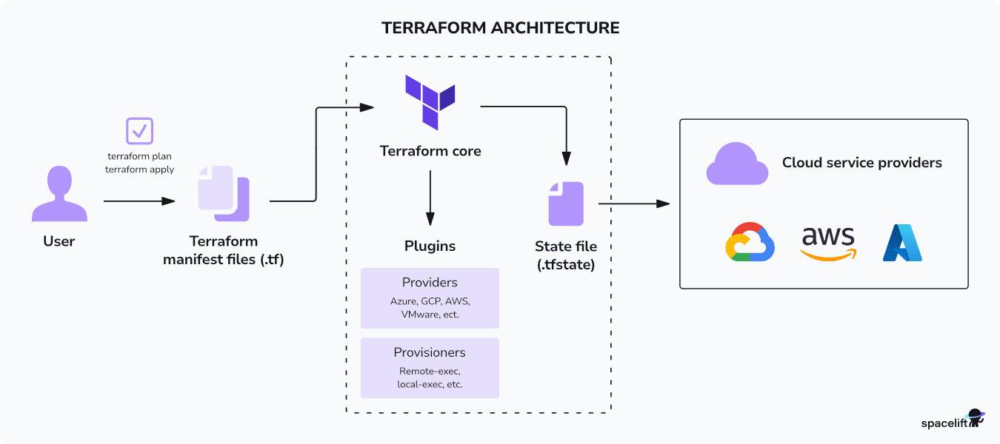
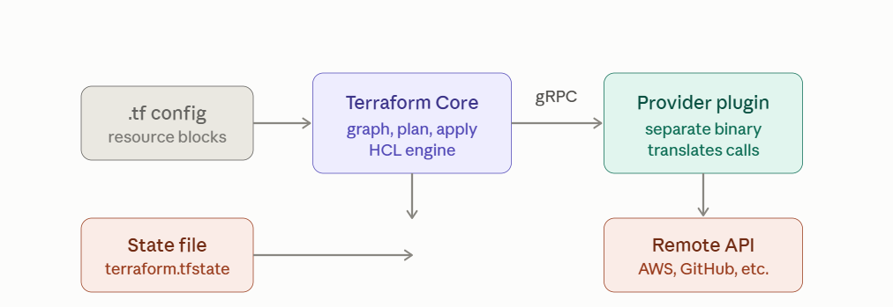
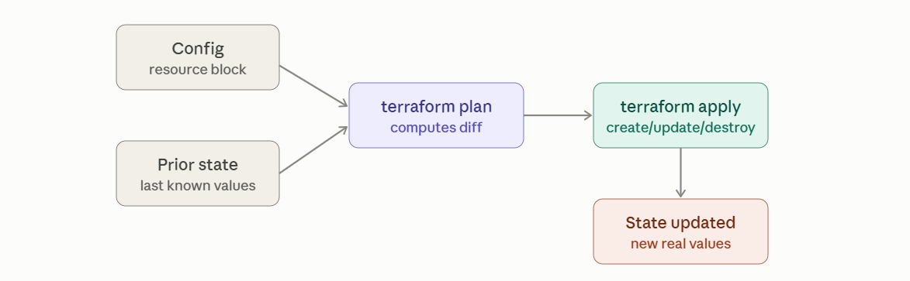

# Terraform

## Why Infrastructure Automation (Terraform)?

## What is infrastructure?

In a software context, **infrastructure** means all the underlying resources an application needs to run — not the application code itself, but everything it sits on top of:

**Compute**: servers, virtual machines, containers

**Networking**: VPCs, subnets, load balancers, DNS, firewalls

**Storage**: disks, object storage (like S3), databases

**Identity & access**: users, roles, permissions

**Supporting services**: message queues, CDNs, monitoring, secrets managers

Basically, if you deployed an app to the cloud, everything you'd need to click through in AWS/Azure/GCP's console to make that app reachable and functional — that's infrastructure.

## Manual infrastructure vs automated infrastructure

Manual provisioning means a human logs into a cloud console (or SSHs into a server) and creates resources by hand — clicking "Create VM," configuring a security group through a UI, setting up a database instance step by step.

Automated provisioning means you write code that describes the infrastructure you want, and a tool reads that code and creates/updates/destroys the actual resources for you. Terraform is one such tool — you declare "I want a VM with these specs, in this network, with this firewall rule," and Terraform figures out the API calls needed to make that true.

This is often called **Infrastructure as Code (IaC)** : infrastructure defined in files, checked into version control(GIT), just like application code.

## Problems in manual provisioning

a. **Not repeatable / inconsistent** — Doing the same steps twice (e.g., for dev, staging, prod) rarely produces identical environments. Small human differences creep in, leading to the classic "works on staging, breaks in prod" problem.

b. **No version history** — If someone changes a firewall rule or resizes a server manually, there's often no record of what changed, who changed it, or why. Rolling back is guesswork.

c. **Slow and doesn't scale** — Clicking through a console to create one server is fine. Doing it for 50 servers, or recreating an entire environment after a disaster, is painfully slow and error-prone.

d. **Human error** — Manual steps mean typos, forgotten steps, misconfigured settings. A missed checkbox in a security group can cause an outage or a security hole.

e. **No single source of truth** — Nobody can look at one place and know exactly what infrastructure exists. You'd have to log into the console and manually audit everything ("configuration drift" — the real world silently diverging from what people think is deployed).

f. **Hard to collaborate** — Multiple people manually changing the same environment can step on each other's changes, with no merge/review process like code has (pull requests, diffs, approvals).

g. **Poor disaster recovery** — If a manually-built environment gets deleted or corrupted, rebuilding it from memory or scattered documentation is slow and risky.

h. **No testing or preview** — You can't easily "dry run" a manual change to see its blast radius before applying it.

" Automation tools like Terraform solve these by giving you declarative, version-controlled, repeatable, previewable infrastructure — you write the desired end state once, and Terraform handles creating it consistently, every time, anywhere ".

# Introduction to Infrastructure as Code (IaC)

## What is IaC?

Infrastructure as Code (IaC) is the practice of managing and provisioning infrastructure through machine-readable definition files, rather than through manual processes or interactive configuration tools.

Instead of clicking around a cloud console, you write code (in a file) that describes what infrastructure you want — servers, networks, databases, permissions — and a tool reads that file and creates it for you. That code is:

**Version-controlled** (stored in Git, just like application code)

**Reusable** (same code can spin up dev, staging, prod)

**Reviewable** (changes go through pull requests, diffs, approvals)

**Executable** (running the code produces real infrastructure)

Popular IaC tools: Terraform, AWS CloudFormation, Pulumi, Ansible, Azure Resource Manager (ARM) templates.

## Declarative vs Imperative approach

This is one of the most important distinctions in IaC.

### Imperative approach 
    you specify the exact steps to reach a goal, in order.

**"Create a VM. Then attach a disk. Then install these packages. Then start this service."**

You're telling the system how to do something, step by step. Tools like shell scripts, Ansible (mostly), and Chef tend to lean imperative.

### Declarative approach 
    you specify the desired end state, and let the tool figure out how to get there.

**"I want 1 VM with this disk, this OS, and this service running."**

You don't say how — you say what. The tool (e.g., Terraform) compares the desired state to the current state and figures out the steps needed to reconcile the difference.

Terraform is declarative.

|Aspect	            |      Imperative	                |      Declarative
|---------------------|-------------------------------- |------------------------|
|You define	          |      Steps to execute	          |   Desired end state                               |
|Order matters?	      |         Yes, strictly	          |   Tool figures out order (dependency graph)       |
|Re-running same code	| May cause errors/duplicates	    | Safe — tool only makes needed changes (idempotent)| 
|Example tools	      | Bash scripts, Ansible playbooks | Terraform, CloudFormation                         |
|Mental model	        | "Do this, then this, then this"	|   "Make it look like this"                       |  

### Why declarative matters in practice: 

if you run your Terraform code today, and again next week, Terraform checks the current real-world state against your code and only changes what's different. Run an imperative script twice and you might try to create the same VM twice, or hit an error because a resource already exists — unless someone carefully coded in checks for that.

## Benefits of IaC

1. **Consistency** — Same code = same result, every time, in every environment. No more "it worked when I clicked it manually last time."

2. **Speed** — Spin up entire environments in minutes instead of hours/days of manual clicking.

3. **Version control & audit trail** — Every infrastructure change is a commit. You know who changed what, when, and why — and can roll back if needed.

4. **Collaboration** — Infrastructure changes go through the same review process as code (pull requests, code review) instead of being invisible manual actions.

5. **Reusability** — Write a module once (e.g., "a standard web server setup"), reuse it across projects and teams.

6. **Preview before applying** — Tools like Terraform let you run a "plan" to see exactly what will change before you commit to the change — reducing risk.

7. **Disaster recovery** — If an environment is destroyed, you can rebuild it from code in minutes rather than trying to remember/reconstruct manual steps.

8. **Reduced human error** — No manual clicking means fewer typos, forgotten steps, and misconfigurations.

9. **Documentation as a side effect** — The code itself documents exactly what infrastructure exists — no need for separate, often-outdated wiki pages.

10. **Cost control** — Easier to spin down unused/temporary environments (e.g., a terraform destroy after a demo) since everything is tracked and reproducible.

## What is Terraform?

### Terraform overview

Terraform is an open-source **Infrastructure as Code (IaC)** tool created by **HashiCorp**. It lets you define infrastructure — servers, networks, storage, DNS, databases, and more — using a declarative configuration language, and then automatically creates, updates, or destroys that infrastructure to match your code.

Core workflow, in three steps:

**Write** — Define desired infrastructure in .tf files using HashiCorp Configuration Language (HCL).

**Plan** — Run terraform plan to preview exactly what Terraform will create, change, or destroy — before anything actually happens.

**Apply** — Run terraform apply to execute those changes against real infrastructure (AWS, Azure, GCP, etc.).

Terraform keeps track of everything it manages in a state file, which acts as its source of truth for what currently exists — this is how it knows what to change on the next run instead of recreating everything from scratch.

## HashiCorp Terraform

Terraform is built and maintained by HashiCorp, a company known for a suite of DevOps/infrastructure tools:

  **Terraform** — infrastructure provisioning

  **Vault** — secrets management

  **Consul** — service networking/discovery

  **Nomad** — workload orchestration

  **Packer** — machine image building

Terraform is written in Go and uses HCL (HashiCorp Configuration Language) — a language designed to be both human-readable and machine-friendly, striking a balance between JSON's machine-parsability and a more approachable syntax for humans.

One important note for anyone following Terraform closely: in 2023, HashiCorp changed Terraform's license from the open-source MPL 2.0 to the Business Source License (BSL), which restricts certain competing commercial uses. In response, the community forked the last MPL-licensed version into OpenTofu, now a Linux Foundation project that remains fully open-source and is largely a drop-in replacement. This is worth knowing since some organizations choose OpenTofu over Terraform specifically because of this licensing shift.

## Why Terraform is popular in DevOps

1. **Declarative & predictable** — You describe the end state; Terraform figures out the steps, and terraform plan shows you exactly what will happen before it happens — reducing risky surprises.

2. **State management** — Terraform tracks real-world infrastructure state, enabling it to detect drift (when reality doesn't match code) and reconcile it.

3. **Huge ecosystem of providers** — Thousands of providers/plugins exist (AWS, Azure, GCP, Kubernetes, GitHub, Datadog, Cloudflare, and many more), so Terraform can manage almost any tool or service with an API, not just cloud infrastructure.

4. **Modularity & reusability** — Terraform modules let teams package reusable infrastructure patterns (e.g., "standard VPC setup") and share them across projects.

5. **Strong community & documentation** — Large user base, an official public registry of modules/providers, and years of battle-testing across the industry.

6. **Fits naturally into CI/CD** — Terraform code can be linted, tested, reviewed via pull requests, and applied automatically in pipelines — bringing infrastructure changes into the same rigor as application code deploys.

7. **Plan/Apply safety net** — The separation between preview (plan) and execution (apply) is a major trust-builder for teams making changes to production infrastructure.

## Cloud-agnostic tool

Terraform is cloud-agnostic, meaning it isn't tied to a single cloud provider. Unlike AWS CloudFormation (AWS-only) or Azure Resource Manager templates (Azure-only), Terraform uses a provider plugin model:

Same HCL language, same workflow (init, plan, apply) regardless of which infrastructure you're managing.
You can manage AWS, Azure, GCP, Kubernetes, Oracle Cloud, DigitalOcean, and hundreds of other platforms — even multiple clouds in the same configuration.
This makes Terraform especially valuable for organizations that are multi-cloud, migrating between clouds, or want to avoid vendor lock-in on the tooling side (though the underlying resources themselves are still provider-specific — Terraform doesn't abstract away the differences between, say, an AWS EC2 instance and an Azure VM, it just lets you manage both with one tool and workflow).

Important nuance: "cloud-agnostic tool" ≠ "cloud-agnostic infrastructure." Terraform gives you one consistent way to manage different clouds, but your actual .tf code for AWS resources will look different from your code for Azure resources, since each cloud's services and APIs are different. What's portable is the tool and workflow, not necessarily the configuration itself.

## Terraform Architecture

Terraform's architecture is built around a simple loop: you declare what you want → Terraform figures out what needs to change → Terraform calls the right APIs to make it happen → Terraform remembers what it did.



Four components make this work: 
**CLI (Core), Providers, Resources, and the State file** . Let's go through each, then go deep on state.

## 1. Terraform CLI (Core)

Terraform Core is the engine. It does four jobs:

1. Reads your **.tf** configuration files

2. Builds a dependency graph of all resources (so it knows what order to create/destroy things in)

3. Diffs **desired state** (your code) against **current state** (the state file) to compute a plan

4. Executes that plan by calling provider APIs

Core commands and what happens internally:

## terraform init

  * Downloads and installs the providers listed in **required_providers**

  * Sets up the backend (where state will be stored)

  * Creates a **.terraform/** directory locally with provider binaries


## terraform plan

  * Reads current .tf code

  * Reads current state file

  * (Optionally) refreshes state by querying real infrastructure

  * Computes a diff: what needs to be added, changed, or destroyed

  * Shows you this diff — nothing is changed yet


## terraform apply


  * Re-runs the plan (or uses a saved plan file)

  * Asks for confirmation (yes)

  * Calls provider APIs in dependency order to create/update/destroy real resources

  * Writes the results into the state file


## terraform destroy


  * Same as apply, but the **"desired state"** is treated as empty — so everything Terraform is tracking gets deleted

### Core commands:

```
terraform init      # Initializes working directory, downloads providers
terraform plan       # Shows what WILL change (preview, no actual changes made)
terraform apply       # Executes the changes (creates/updates/destroys real resources)
terraform destroy    # Tears down everything Terraform manages in this config
terraform validate   # Checks syntax/config validity without contacting the cloud
terraform fmt        # Auto-formats .tf files to standard style
```

### Example workflow:

```
    $ terraform init
    Initializing the backend...
    Initializing provider plugins...
    - Installing hashicorp/aws v5.40.0...
    Terraform has been successfully initialized!

    $ terraform plan
    Terraform will perform the following actions:
    # aws_instance.web will be created
    + resource "aws_instance" "web" {
        + ami           = "ami-0abcdef1234567890"
        + instance_type = "t2.micro"
        + id            = (known after apply)
        }
    Plan: 1 to add, 0 to change, 0 to destroy.

    $ terraform apply
    Do you want to perform these actions?
    Terraform will perform the actions described above.
    Only 'yes' will be accepted to approve.
    Enter a value: yes

    aws_instance.web: Creating...
    aws_instance.web: Creation complete after 32s [id=i-0a1b2c3d4e5f]
    Apply complete! Resources: 1 added, 0 changed, 0 destroyed.
```

**Note**:Notice init runs once per project setup, then plan → apply becomes your everyday loop.

## 2. Providers

A provider is a plugin that lets Terraform talk to a specific platform's API — AWS, Azure, GCP, Kubernetes, GitHub, Cloudflare, etc. The provider translates your HCL resource blocks into actual API calls.

Terraform core itself knows almost nothing about any specific platform. It only understands the language (HCL), the state file format, and a dependency graph. All the actual "how do I create an EC2 instance" logic lives in providers — separate compiled binaries that speak a defined protocol to Terraform core over gRPC.



The key thing to internalize: Terraform core and providers are separate processes that talk over a defined RPC protocol. Core doesn't know what an "aws_instance" is — the AWS provider does. This separation is what lets Terraform support hundreds of platforms with one core engine.

**1. Declaring and configuring a provider**

Every root module needs a required_providers block (inside terraform {}) and, usually, a provider {} block with config:
```
terraform {
  required_providers {
    aws = {
      source  = "hashicorp/aws"
      version = "~> 5.0"
    }
  }
}

provider "aws" {
  region = "ap-south-1"   # Hyderabad-region users often pick ap-south-1 (Mumbai)
}
```

* **source** is <namespace>/<name> on the Terraform Registry (or a private registry host, e.g. mycompany.com/networking/aws).

* **version** is a constraint, not a pin: ~> 5.0 means "5.x, latest patch/minor," >= 5.2, < 6.0 is explicit, =5.4.1 pins exactly.

* The **provider** block holds provider-specific settings: region, endpoint, credentials, default tags, etc. — this is not standardized across providers; each one defines its own schema.

Multiple configurations of the same provider use alias, useful for multi-region or multi-account setups:

  provider "aws" {
    alias  = "west"
    region = "us-west-2"
  }

  resource "aws_instance" "example" {
    provider = aws.west
    # ...
  }

**2. How terraform init resolves providers**

When you run init, Terraform:

a. Reads every required_providers block across your modules and computes a combined version constraint.

b. Queries the registry (or your configured mirror) for matching versions.

c. Downloads the matching plugin binary for your OS/arch into .terraform/providers/.

d. Writes exact resolved versions + checksums into .terraform.lock.hcl — this lock file should be committed to version control so every teammate and CI run gets byte-identical provider binaries.

**3. The provider protocol (how core and plugin actually talk)**

At apply time, Terraform core launches the provider binary as a child process. The provider prints a handshake line to stdout, then the two speak gRPC over a Unix socket (or named pipe on Windows) using a protobuf schema defined by Terraform (protocol version 5 or 6). The RPCs a provider implements include roughly:

* **GetProviderSchema** — describe every resource/data source and their attributes

* **ValidateResourceConfig** — config-time validation

* **PlanResourceChange** — given prior state + proposed config, return the planned diff

* **ApplyResourceChange** — actually create/update/delete

* **ReadResource** — refresh state from the real infrastructure

* **ImportResourceState** — bring an existing resource under management

This is why **terraform plan** can show you a diff without touching real infrastructure — it's calling **PlanResourceChange**, not **ApplyResourceChange**.

**4. Resources vs. data sources**

A provider exposes two kinds of schema objects:

* **Resources** (resource "aws_instance" "x" {}) — things Terraform creates, updates, and destroys; tracked in state.

* **Data sources** (data "aws_ami" "x" {}) — read-only lookups against existing infrastructure, not owned or destroyed by Terraform.

Every resource type belongs to exactly one provider, determined by its name prefix (aws_* → aws provider) unless you override with the provider meta-argument.

**5. Authentication**

Providers pick up credentials in provider-specific ways, typically layered (env vars → shared config files → explicit block arguments → instance/workload identity). 

For AWS specifically: environment variables <mark>(AWS_ACCESS_KEY_ID), ~/.aws/credentials,</mark> an EC2/ECS instance role, or explicit access_key/secret_key in the block (avoid this last one — don't hardcode secrets in .tf files). Most major cloud providers also support OIDC federation from CI systems now, which avoids long-lived static credentials entirely.

**6. Writing your own provider**

If you want to expose a custom API as Terraform resources, you build a provider as a small Go program using HashiCorp's terraform-plugin-framework (the modern SDK, superseding the older terraform-plugin-sdk/v2).

Minimal skeleton:

    go
    package main

    import (
        "context"
        "github.com/hashicorp/terraform-plugin-framework/providerserver"
        "github.com/hashicorp/terraform-plugin-framework/provider"
    )

    func main() {
        providerserver.Serve(context.Background(), New, providerserver.ServeOpts{
            Address: "registry.terraform.io/myorg/myprovider",
        })
    }

    func New() provider.Provider {
        return &myProvider{}
    }

You then implement the provider.Provider interface (Metadata, Schema, Configure, Resources, DataSources), and for each resource type implement resource.Resource with Create, Read, Update, Delete methods that call your backend's SDK/API and map results into Terraform's typed state model.

Local development loop:

    # ~/.terraformrc
    provider_installation {
      dev_overrides {
        "myorg/myprovider" = "/path/to/go/bin"
      }
      direct {}
    }

This lets **terraform plan** use your locally-built binary instead of downloading from the registry.

**7. Testing a provider**

The framework ships an acceptance testing harness (resource.Test) that actually runs terraform apply against your resource against real (or mocked) infrastructure, asserting on the resulting state — this is the standard pattern used by HashiCorp's own providers, guarded behind a TF_ACC=1 env var since these tests hit real APIs and can cost money.

**8. Publishing**

To list a provider on the public Terraform Registry: push a GitHub repo named terraform-provider-<name>, tag a semver release, sign your release artifacts with a GPG key, and the registry auto-ingests it via GitHub's release webhook — no separate upload step. Private/internal providers instead go through a private registry (Terraform Cloud/Enterprise's built-in one, or any host implementing the Provider Registry Protocol).

## 3. Resources

A resource is the actual infrastructure object you want Terraform to create/manage — a VM, a network, a database, a DNS record. This is the core building block of any Terraform config.

A resource block is the core unit of Terraform — it's the declaration that says "this specific object should exist, with these attributes, and I want you to manage its full lifecycle".

Let's go through everything about it.



#### Anatomy of the block

```
resource "aws_instance" "web" {
  ami           = "ami-0abcdef1234567890"
  instance_type = "t3.micro"

  tags = {
    Name = "web-server"
  }
}
```

**"aws_instance"** — the resource type. The prefix (aws_) determines which provider owns it.
**"web"** — the local name, unique within the module. Together, aws_instance.web is the resource's address.

The body — arguments defined by that resource type's schema, which the provider itself declares (via GetProviderSchema, from the earlier diagram). Terraform core doesn't know what instance_type means; it just passes it through.

#### What happens to a resource block, step by step

terraform plan classifies every resource into one of four actions:

* **Create** — resource in config, nothing in state.

* **Update in place** — resource exists, and the changed attribute can be modified without recreating (e.g. tags).

* **Replace (destroy + create)** — a changed attribute is marked ForceNew by the provider schema (e.g. changing an EC2 instance's availability_zone usually requires a new instance).

* **Destroy** — resource in state, removed from config.

Whether a change is in-place or forces replacement isn't up to you — it's baked into the provider's schema for that attribute.

#### Meta-arguments

These aren't provider-specific; every resource block supports them regardless of type.

**count** — creates N instances from one block, indexed [0], [1], etc.

```
  resource "aws_instance" "web" {
    count         = 3
    ami           = "ami-0abcdef1234567890"
    instance_type = "t3.micro"
  }
```

    addresses: aws_instance.web[0], web[1], web[2]

**for_each** — creates one instance per key in a map or set, addressed by key instead of index. Preferred over count when items might be added/removed from the middle of a list, since count reindexes everything and can cause unwanted destroy/recreate cascades.

```
resource "aws_instance" "web" {
  for_each      = { small = "t3.micro", large = "t3.large" }
  ami           = "ami-0abcdef1234567890"
  instance_type = each.value
}
```

    addresses: aws_instance.web["small"], web["large"]

**provider** — selects a specific aliased provider configuration (shown in the earlier multi-region example).

**depends_on** — explicit ordering for dependencies invisible to the graph (covered in depth in your previous question).

**lifecycle block** — customizes how Terraform handles changes:

```
resource "aws_instance" "web" {

  lifecycle {
    create_before_destroy = true
    prevent_destroy        = true
    ignore_changes          = [tags["LastDeployedBy"]]
    replace_triggered_by    = [aws_launch_template.web.id]
  }
}
```

* create_before_destroy — for replacements, build the new resource before tearing down the old one (avoids downtime; needed anywhere else references this resource, like a load balancer target).

* prevent_destroy — hard-stops any plan that would destroy this resource (a safety rail for stateful things like databases).

* ignore_changes — tell Terraform to stop diffing specific attributes, even if they drift (useful when something outside Terraform, like an autoscaler, mutates a field).

* replace_triggered_by — force replacement whenever a referenced value changes, even if none of this resource's own arguments changed.

**timeouts block** — some resource types let you override how long Terraform waits for an operation before giving up:

```
resource "aws_db_instance" "main" {

  timeouts {
    create = "60m"
    delete = "2h"
  }
}
```

**Provisioners** (local-exec, remote-exec) — run scripts on create/destroy as a last resort, when there's genuinely no API-native way to configure something. HashiCorp explicitly discourages these as a first choice, since they're invisible to plan's diff and fragile compared to native resource attributes or purpose-built tools like cloud-init/Ansible.

## 4. State file

The state file (terraform.tfstate) is a JSON file that is Terraform's memory — a record of every resource it has created and the real-world attributes of each, at the time it last checked.

It exists because of one core problem: your .tf code alone cannot tell Terraform what already exists. Your code says "I want an aws_instance named web." It doesn't say "and it's already running as i-0a1b2c3d4e5f in us-east-1." Only the state file knows that mapping.

The state file (terraform.tfstate) is how Terraform keeps track of what infrastructure it has actually created, and maps it back to your configuration. It's Terraform's "source of truth" for the real world.

Why it's needed: Terraform config describes desired state. The state file records current (last-known) state. When you run terraform plan, Terraform compares:

**Your .tf code (desired)  vs  State file (last known)  vs  Real infrastructure (actual)**

...and figures out the minimum changes needed to reconcile them.

### The three-way comparison

Every terraform plan involves comparing three things, not two:

|	                       |            What it is                                                       |
|-------------------------|----------------------------------------------------------------------------|
|**Configuration**	     |   Your .tf files — the desired state                                        |
|**State file**          |	Terraform's record of what it created — the last known state               |
|**Real infrastructure** |	What's actually running in AWS/Azure/GCP right now — the actual state      |  

#### Example — simplified terraform.tfstate content (JSON):

```
  {
    "version": 4,
    "terraform_version": "1.7.0",
    "resources": [
      {
        "type": "aws_instance",
        "name": "web",
        "provider": "provider[\"registry.terraform.io/hashicorp/aws\"]",
        "instances": [
          {
            "attributes": {
              "id": "i-0a1b2c3d4e5f",
              "ami": "ami-0abcdef1234567890",
              "instance_type": "t2.micro",
              "public_ip": "13.234.56.78"
            }
          }
        ]
      }
    ]
  }
```

Notice it stores actual real-world values (like id and public_ip) that only exist after creation — your .tf code doesn't know these in advance, but the state file does, once applied.

## What the state file enables:

|Without state                                   |       	With state                                  |
|------------------------------------------------|----------------------------------------------------|
|Terraform doesn't know what already exists	     |  Terraform knows exactly what it manages           |
|Every apply might try to recreate everything	   |   Only diffs are applied (idempotent)              |
|No way to map .tf resource → real cloud object  |	 State maps aws_instance.web → i-0a1b2c3d4e5f     |
|Can't detect drift	                             |   terraform plan shows drift vs. code              |

### Important practical notes:

* State often contains sensitive data (e.g., DB passwords in attributes), so it should never be committed to public Git repos.
* In teams, state is usually stored remotely (e.g., an S3 bucket + DynamoDB lock table, or Terraform Cloud) instead of a local file, so multiple people don't overwrite each other's state and to avoid "I ran apply on my laptop and now my state is out of sync with everyone else's."

```
  terraform {
    backend "s3" {
      bucket = "my-terraform-state-bucket"
      key    = "prod/terraform.tfstate"
      region = "ap-south-1"
      dynamodb_table = "terraform-locks"   # prevents concurrent applies
    }
  }
```

### Anatomy of a state file

```
  {
    "version": 4,
    "terraform_version": "1.7.0",
    "serial": 3,
    "lineage": "8f3b2a1c-9d4e-4f5a-b6c7-1a2b3c4d5e6f",
    "outputs": {
      "instance_ip": {
        "value": "13.234.56.78",
        "type": "string"
      }
    },
    "resources": [
      {
        "mode": "managed",
        "type": "aws_instance",
        "name": "web",
        "provider": "provider[\"registry.terraform.io/hashicorp/aws\"]",
        "instances": [
          {
            "schema_version": 1,
            "attributes": {
              "id": "i-0a1b2c3d4e5f",
              "ami": "ami-0abcdef1234567890",
              "instance_type": "t2.micro",
              "public_ip": "13.234.56.78",
              "private_ip": "10.0.1.15",
              "tags": { "Name": "MyWebServer" }
            },
            "dependencies": []
          }
        ]
      }
    ]
  }
```

#### Key fields explained:

* **version** — the internal state file format version (not the Terraform version)

* **terraform_version** — which Terraform CLI version last wrote this file

* **serial** — increments every time state changes; used to detect state file conflicts

* **lineage** — a unique ID for this state's "lineage"; if two state files have different lineage IDs, Terraform knows they didn't originate from the same state history (protects against accidentally mixing unrelated states)

* **resources** — the actual list of everything Terraform manages, with all real attributes filled in (IDs, IPs, ARNs, etc. — things that don't exist until after creation)

* **outputs** — values you've explicitly exposed via output blocks

This is why state is so powerful: it holds the actual, resolved values — not just what you wrote in code, but what the cloud provider assigned back.

### Why the state file matters — core purposes

1. **Mapping code to real resources**

aws_instance.web in your code has no meaning to AWS. The state file maps that local name to i-0a1b2c3d4e5f — the real resource ID AWS understands. Without this mapping, Terraform would have no way to know which real object corresponds to which block in your code.

2. **Performance**

Without state, Terraform would have to query every resource from the cloud API on every run just to know what exists. State acts as a cache, so terraform plan is fast — it only refreshes what's needed.

3. **Dependency tracking**

State stores the dependencies between resources, so Terraform knows destroy order too (reverse of creation order) — e.g., delete the EC2 instance before deleting the VPC it sits in.

4. **Drift detection**

Because state records the last-known attributes, Terraform can compare it against real infrastructure and flag when something was changed outside of Terraform (manual console edits, another script, etc.).

5. **Enables collaboration**

When state is stored remotely and shared, every team member's terraform plan sees the same source of truth — not just what's on their own laptop.

### Local vs Remote State

#### Local state (default)

By default, Terraform stores state as a plain file terraform.tfstate in your working directory.

#### Problems with local state in a team:

* Only one person has it — others can't see current state

* No locking — two people running apply simultaneously can corrupt state or cause conflicting changes

* Often contains secrets (DB passwords, private keys as resource attributes) — dangerous if committed to Git

* No backup if your laptop dies

### Remote state (recommended for real projects)

Remote backends store state in a shared, durable location — an S3 bucket, Azure Storage, GCS bucket, Terraform Cloud, etc.

```
  terraform {
    backend "s3" {
      bucket         = "my-terraform-state-bucket"
      key            = "prod/network/terraform.tfstate"
      region         = "ap-south-1"
      dynamodb_table = "terraform-locks"   # enables state locking
      encrypt        = true
    }
  }
```

### Benefits of remote state:

* **Shared source of truth** — whole team sees the same state

* **Locking** — prevents two people from running apply at the same time and corrupting state (via DynamoDB table in the S3 example above)

* **Encryption at rest** — protects sensitive data

* **Versioning** — S3 versioning lets you roll back to a previous state file if something goes wrong

* **Separation from code** — state doesn't live in your Git repo where secrets could leak
State Locking

When someone runs **terraform apply**, Terraform **locks the state file** so no one else can run apply/plan (that writes state) concurrently.

```
  $ terraform apply
  Acquiring state lock. This may take a few moments...

If a second person tries to apply at the same time:

  Error: Error acquiring the state lock

  Lock Info:
    ID:        d1e2f3a4-b5c6-d7e8-f9a0-b1c2d3e4f5a6
    Path:      prod/network/terraform.tfstate
    Operation: OperationTypeApply
    Who:       alice@devbox
    Created:   2026-08-10 10:15:32 UTC
```

This prevents two simultaneous applies from racing and corrupting the state (e.g., both trying to create the same resource, or one overwriting the other's changes).

#### Sensitive Data in State

**Important**: the state file often contains plaintext **sensitive value*s** — **database passwords** set via resource arguments, **private keys**, **connection string** — because Terraform needs to track the actual values it applied.

```
  "attributes": {
    "username": "admin",
    "password": "SuperSecret123!"
  }
```

#### Because of this:

* Never commit terraform.tfstate to Git, especially public repos

* Use remote backends with encryption at rest (S3 + SSE, Terraform Cloud, etc.)

* Restrict IAM/access permissions on who can read the state backend

* Consider tools like Vault for secrets instead of passing raw secrets through Terraform variables where possible

### Common State Commands

* **Lists** all resources currently tracked in state.
 
  terraform state list
    #aws_instance.web
    #aws_vpc.main

* Shows detailed attributes of a specific resource from state.
  
  terraform state show aws_instance.web

* **Renames** a resource in state without destroying/recreating it — useful when refactoring code.

  terraform state mv aws_instance.web aws_instance.web_server

* **Removes** a resource from Terraform's tracking without deleting the real resource — Terraform "forgets" about it, but it still exists in AWS.

  terraform state rm aws_instance.web

* **Imports** an existing, manually-created resource into Terraform state, so Terraform can start managing something that wasn't originally created by Terraform.

  terraform import aws_instance.web i-0a1b2c3d4e5f

* (Now largely folded into plan/apply) Reconciles state with real infrastructure without changing anything — pulls in the latest real-world attribute values.
  
  terraform refresh


## Drift Detection in Action

If someone manually changes something in the AWS console (e.g., resizes an instance outside Terraform), the real infrastructure no longer matches the state file. This mismatch is called drift, and terraform plan will detect and show it.

Say someone manually changes the instance type in the AWS console from t2.micro to t2.large, bypassing Terraform entirely.

```
  $ terraform plan
      aws_instance.web: Refreshing state... [id=i-0a1b2c3d4e5f]

      Terraform detected the following changes made outside of Terraform:

        # aws_instance.web has changed
        ~ resource "aws_instance" "web" {
            ~ instance_type = "t2.micro" -> "t2.large"
              id            = "i-0a1b2c3d4e5f"
          }

      Terraform will then:
        ~ instance_type = "t2.large" -> "t2.micro"   # to match your code

      Plan: 0 to add, 1 to change, 0 to destroy.
```

Terraform shows you the drift and, since your .tf code still says t2.micro, it will plan to revert it back to match your code on the next apply — unless you update your code to match the new reality instead.

## State File Isolation: Workspaces & Splitting

Two common patterns to avoid one giant, risky state file:

**1.Workspaces** — same code, multiple isolated states (e.g., dev/staging/prod):

  terraform workspace new dev

  terraform workspace new prod
  
  terraform workspace select dev

Each workspace gets its own state, so apply in dev never touches prod resources.

**2.Splitting state by component** — e.g., separate state files for network/, database/, compute/ — so a mistake in one area has a smaller blast radius, and teams can own different parts independently. Data is shared between them using terraform_remote_state data sources or outputs.

State is what turns Terraform from "a script that creates things" into "a system that maintains a living, accurate model of your infrastructure over time."

Run terraform init (downloads AWS provider) → terraform plan (shows it will create 1 instance) → terraform apply (creates it, records details in terraform.tfstate) → run terraform plan again later and Terraform compares your code + state + real AWS to tell you if anything drifted.

## What goes in .tf configuration files?

.tf files are where you write your Terraform configuration in HCL (HashiCorp Configuration Language). A handful of block types cover almost everything you'll ever write.

### The core block types

* **terraform block** — meta-configuration for Terraform itself: required provider versions, the required Terraform CLI version, and backend configuration (where state is stored).

```
terraform {
  required_version = ">= 1.7.0"
  required_providers {
    aws = {
      source  = "hashicorp/aws"
      version = "~> 5.0"
    }
  }
  backend "s3" {
    bucket = "my-tfstate"
    key    = "prod/terraform.tfstate"
    region = "us-east-1"
  }
}
```

* **provider block** — configures a provider instance (covered in depth above).

* **resource block** — the main event. Declares an infrastructure object Terraform should create, update, and destroy. Syntax is resource "<type>" "<local_name>" { ... }.

```
resource "aws_instance" "web" {
  ami           = "ami-0abcdef1234567890"
  instance_type = "t3.micro"

  tags = {
    Name = "web-server"
  }
}
```

* **data block** — a read-only lookup of something that already exists (an AMI, an existing VPC, a DNS zone) so you can reference it without managing it.

```
data "aws_ami" "ubuntu" {
  most_recent = true
  owners      = ["099720109477"]
  filter {
    name   = "name"
    values = ["ubuntu/images/*22.04*"]
  }
```

* **variable block** — declares an input parameter for the module, optionally with a type, default, and validation rules.

```
variable "instance_type" {
  type        = string
  default     = "t3.micro"
  description = "EC2 instance size"
}
```

* **output block** — exposes a value from this module to whoever calls it (a parent module, or the CLI after apply).

```
output "instance_ip" {
  value = aws_instance.web.public_ip
}
```

* **locals block** — named expressions for reuse within the module; not inputs, not outputs, just internal convenience values.

```
locals {
  name_prefix = "${var.environment}-${var.project}"
}
```

* **module block** — calls another module (local or remote), passing variables in and reading outputs out.

```
module "vpc" {
  source  = "terraform-aws-modules/vpc/aws"
  version = "5.8.1"
  cidr    = "10.0.0.0/16"
}
```

### How references work between blocks

Everything lives in one implicit namespace per module, so you reference things by type and name:

* **Resource attribute**: aws_instance.web.public_ip
* **Data source attribute**: data.aws_ami.ubuntu.id
* **Variable**: var.instance_type
* **Local**: local.name_prefix
* **Module output**: module.vpc.vpc_id

Terraform builds a dependency graph from these references automatically — you rarely need explicit **depends_on** unless a dependency isn't visible through an attribute reference (e.g. IAM eventual consistency).

### **depends_on:**
Let me break this into two parts: how **implicit dependencies** work, and a concrete case where they fail and you need **depends_on**.

Implicit dependencies: via attribute references

When one resource's argument references another resource's attribute, Terraform sees that reference in the configuration and knows it must create/update the referenced resource before the one that depends on it.

```
resource "aws_vpc" "main" {
  cidr_block = "10.0.0.0/16"
}

resource "aws_subnet" "web" {
  vpc_id     = aws_vpc.main.id      # <- reference
  cidr_block = "10.0.1.0/24"
}

resource "aws_instance" "app" {
  subnet_id = aws_subnet.web.id     # <- reference
  ami       = "ami-0abcdef1234567890"
  instance_type = "t3.micro"
}
```

Terraform parses the config, sees aws_subnet.web uses aws_vpc.main.id, and aws_instance.app uses aws_subnet.web.id. It builds this graph automatically:

No depends_on needed anywhere here — the graph came entirely from the id references.

When the graph can't see the dependency

Terraform only knows about relationships that show up as expressions in the config. If resource B depends on resource A being fully ready, but B's arguments don't reference any of A's attributes, Terraform has no way to know — and may try to create both in parallel, or in the wrong order.

The classic example is IAM eventual consistency on AWS. Say you create an IAM role and then a Lambda function that assumes it:

```
resource "aws_iam_role" "lambda_exec" {
  name               = "lambda-exec-role"
  assume_role_policy = data.aws_iam_policy_document.lambda_assume.json
}

resource "aws_iam_role_policy_attachment" "lambda_logs" {
  role       = aws_iam_role.lambda_exec.name
  policy_arn = "arn:aws:iam::aws:policy/service-role/AWSLambdaBasicExecutionRole"
}

resource "aws_lambda_function" "app" {
  function_name = "my-app"
  role          = aws_iam_role.lambda_exec.arn   # <- this reference IS captured
  # ...
}
```

Here aws_lambda_function.app does reference aws_iam_role.lambda_exec.arn, so Terraform correctly orders role creation before the Lambda. So far so good — but this is exactly where the hidden problem lives: AWS's IAM API can return "success" before the role has actually propagated to every region/service that needs to see it. Terraform's graph says "role created, safe to proceed," fires the CreateFunction call immediately, and AWS sometimes rejects it with InvalidParameterValueException: The role defined for the function cannot be assumed by Lambda — even though the reference-based ordering was technically correct. The dependency existed in the graph; the problem is timing after creation, not ordering, and no attribute reference can express "and then wait a bit."

A cleaner example of truly invisible dependencies — no attribute reference at all — is something like a resource that needs an S3 bucket policy to exist first, but only reads from a bucket name string you typed manually instead of referencing the resource:

```
resource "aws_s3_bucket_policy" "logs" {
  bucket = "my-central-logs-bucket"
  policy = data.aws_iam_policy_document.allow_write.json
}

resource "aws_cloudtrail" "main" {
  name           = "org-trail"
  s3_bucket_name = "my-central-logs-bucket"   # hardcoded string, not a reference!

  depends_on = [aws_s3_bucket_policy.logs]     # <- must be explicit
}
```

Because s3_bucket_name is a literal string rather than aws_s3_bucket.logs.bucket, Terraform's graph builder sees zero connection between these two resources. Without depends_on, it might create the CloudTrail trail before the bucket policy exists, and AWS rejects it because CloudTrail can't yet write to that bucket.

The rule of thumb

* Prefer references over hardcoded values wherever possible — aws_s3_bucket.logs.bucket instead of a string literal — because that's what actually builds the graph edge, not just documentation.

* Reach for depends_on only when: (a) there's a real ordering dependency, (b) it isn't expressible through an attribute reference, and (c) you can't fix it by just referencing the resource properly instead.

* depends_on takes a list of resource/module references, and forces strict ordering without needing to actually use any of the dependency's output values.

### File organization is a convention, not a rule

Terraform loads every .tf file in a directory as one combined configuration — file names don't matter to the engine. The common convention (used by most teams and by terraform-docs/module generators) is:

* **main.tf** — providers and primary resources
* **variables.tf** — all variable blocks
* **outputs.tf** — all output blocks
* **versions.tf** — the terraform block with version constraints
* **locals.tf** — locals block, if large enough to warrant its own file

You could put everything in one giant file and it'd work identically — the split exists purely for human readability.

