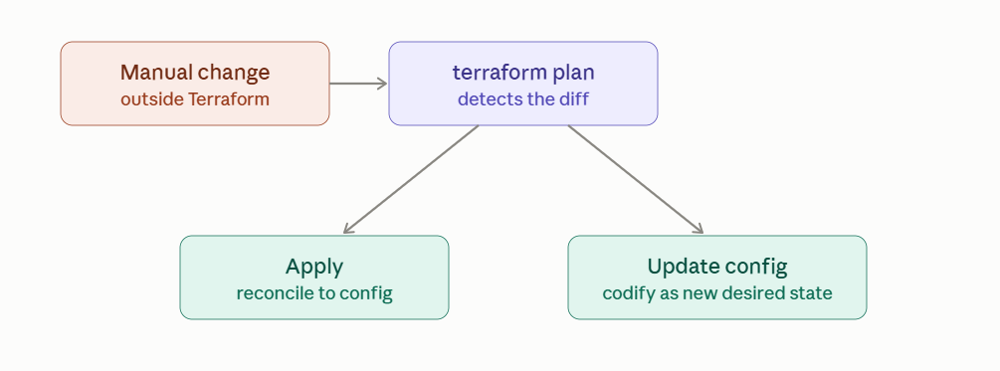

# Terraform Drift Detection

## What infrastructure drift actually is

Drift is any gap between what's in Terraform's state file and what's actually running in the real platform. Terraform assumes it owns everything it tracks — the moment something else touches that resource, the assumption breaks silently, and you don't find out until the next plan.

**Common causes:**

* Someone manually edits a resource in the AWS/Azure/GCP console ("just this once, to fix an incident")

* An auto-scaler, Lambda, or external automation changes an attribute Terraform also manages (e.g. desired capacity)

* Another tool or team's pipeline touches the same resource

* The cloud provider itself changes something (an AMI gets deprecated, a default value shifts)

* A previous apply partially failed, leaving real infrastructure ahead of or behind the recorded state



## How Terraform actually detects it

Every terraform plan performs an implicit refresh — calling each managed resource's ReadResource RPC (from the provider protocol you learned earlier) to pull its real current attributes, then diffing that against state. If they differ, that shows up as a change in the plan even though you didn't touch your .tf files.

```
    terraform plan
    # Note: Objects have changed outside of Terraform
    #
    #  # aws_instance.web has changed
    #  ~ instance_type = "t3.micro" -> "t3.large"
    #      (this resource was modified outside Terraform, may need reconciliation)
```

For a dedicated, apply-free drift check — useful in CI on a schedule, without risking an accidental apply — use refresh-only mode:

```
terraform plan -refresh-only
```

This shows only what's drifted, without proposing any config-driven changes, and is the safest command to run unattended on a cron/schedule purely for detection.

**Remediation strategies**

There isn't one universally correct fix — it depends on whether the manual change was a mistake or a legitimate need Terraform's config just hasn't caught up to yet.

**1. Reconcile** — apply to force it back to config. The standard response when the manual change was unintended or unauthorized (an incident-response hotfix, a misclick in the console):

```
terraform apply
```

This overwrites the drifted attribute back to whatever the config says it should be.

**2. Codify** — update the config to match reality. When the manual change was correct and should actually become the new permanent desired state (someone genuinely needed to bump the instance size and it should stick):

```
resource "aws_instance" "web" {
  instance_type = "t3.large"   # updated to match what's actually running
}
```

Then run terraform apply -refresh-only first to formally accept the drifted state, or just apply normally — since your config now matches reality, the plan should show no changes.

**3. Tolerate** — ignore_changes for attributes that are expected to drift. Some attributes are legitimately managed by something other than Terraform (an autoscaler adjusting desired_capacity, a deployment tool rotating an AMI) — for those, tell Terraform to stop treating divergence as drift at all:

```
resource "aws_autoscaling_group" "app" {
  # ...
  lifecycle {
    ignore_changes = [desired_capacity]
  }
}
```

This is the lifecycle block from your resources question, applied specifically to the drift use case.

**4. Automate detection as a scheduled check.** A common CI pattern is a nightly/hourly job that runs terraform plan -refresh-only -detailed-exitcode on every managed stack — exit code 2 means drift was detected, which can trigger a Slack alert without ever touching apply:

```
# example CI step
- run: terraform plan -refresh-only -detailed-exitcode
  continue-on-error: true
  id: drift
- if: steps.drift.outputs.exitcode == '2'
  run: echo "Drift detected — notify the team"
```

**5. Platform-native drift detection.** Terraform Cloud/Enterprise has a built-in scheduled drift detection feature that runs this refresh-only check automatically across all workspaces and surfaces results in its UI — worth using instead of hand-rolling the CI job above if you're already on that platform.

**Practical guidance**

* The real fix for chronic drift is almost always process, not tooling — restrict console/manual write access on anything Terraform manages, so drift becomes the rare exception instead of routine.

* Use ignore_changes sparingly and specifically (name the exact attributes), not with the wildcard ignore_changes = all — that silences drift detection for the entire resource, hiding genuinely unintended changes along with the expected ones.

* Treat "reconcile vs. codify" as a real decision each time, not a reflex — blindly apply-ing to stomp every drift can undo a legitimate emergency fix someone made for good reason.